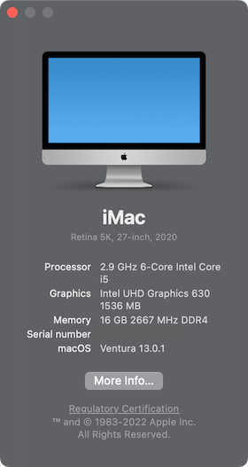
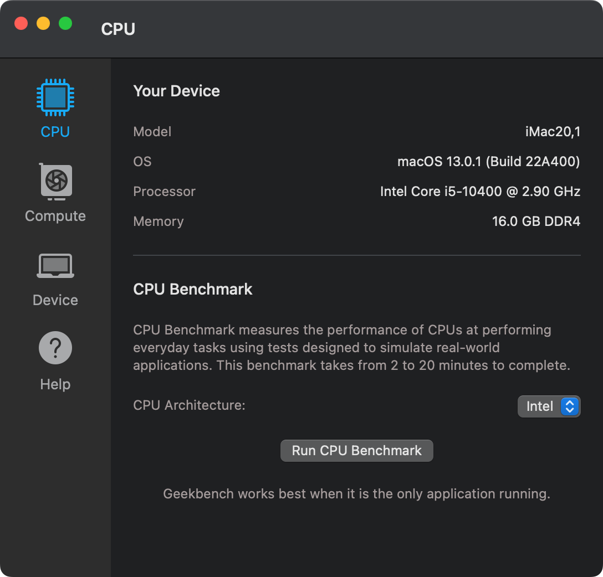
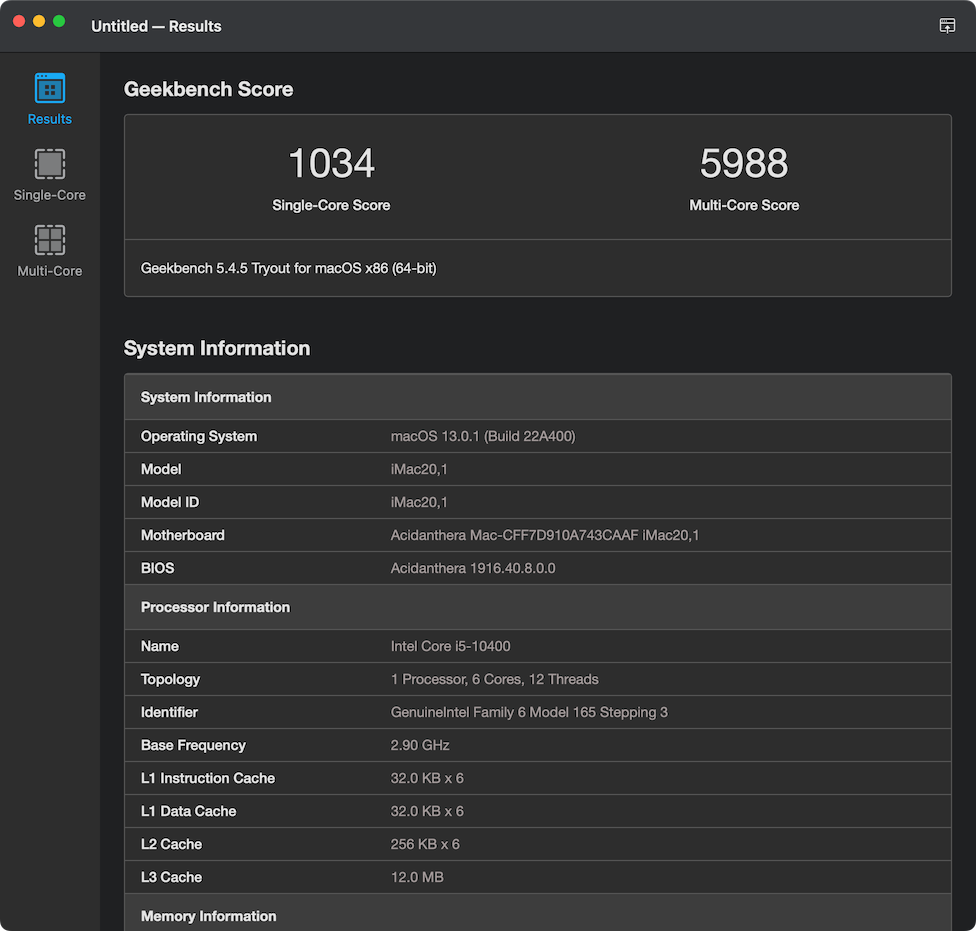

## ThinkCentre-E77 Intel Gen10 Hackintosh OpenCore EFI


### [简体中文](README.zh_CN.md)


### OpenCore

[OpenCore 0.9.1](https://github.com/acidanthera/OpenCorePkg)


### Spec

- Chipset: B460
- CPU: Intel 10th i5-10400
- Memo: Samsung 16GB(2x8GB) DDR4 2666 Mhz
- iGPU: Intel UHD Graphic 630
- HDA: Realtek ALC623
- SSD: WD SN750 512G
- LAN: Realtek RTL8111HSD
- WLAN: BCM943602CS


### BIOS

```
Devices
  |-- Serial Port Setup
    |-- Serial Port1 Address: Disabled
  |-- ATA Drive Setup
    |-- Configure STAT as: ACHI
  |-- Video Setup
    |-- Select Active Video: IGD
    |-- Pre-Allocated Memory Size: 64MB
    |-- Total Graphics Memory: Maximum

Advanced
  |-- CPU Setup
    |-- Intel(R) Hyper-Threading Technology: Enabled
    |-- Core Multi-Processing: Enabled
    |-- Intel(R) Virtualization Technology: Enabled
    |-- VT-d Feature: Disabled

Security
  |-- Secure Boot
    |-- Secure Boot: Disabled

Startup
  |-- Fast Boot: Disabled
```


### Screenshot








### Kexts

- [Lilu.kext 1.6.4](https://github.com/acidanthera/Lilu)
- [SMCProcessor.kext 1.3.1](https://github.com/acidanthera/VirtualSMC)
- [SMCSuperIO.kext 1.3.1](https://github.com/acidanthera/VirtualSMC)
- [VirtualSMC.kext 1.3.1](https://github.com/acidanthera/VirtualSMC)
- [WhateverGreen.kext 1.6.4](https://github.com/acidanthera/WhateverGreen)
- [NVMeFix.kext 1.1.0](https://github.com/acidanthera/NVMeFix)
- [AppleALC.kext 1.8.1](https://github.com/acidanthera/AppleALC)
- [RealtekRTL8111.kext 2.4.2](https://github.com/Mieze/RTL8111_driver_for_OS_X)
- [XHCI-unsupported.kext 0.9.2](https://github.com/hackintosh-efi/XHCI-unsupported)


### Tools

- [Hackintool](https://github.com/headkaze/Hackintool) 
- [OCAuxiliaryTools](https://github.com/ic005k/OCAuxiliaryTools) AKA `OCAT`.
- [OpenCore Configurator](https://mackie100projects.altervista.org/opencore-configurator/) AKA `OCC`.
- [GenSMBIOS](https://github.com/corpnewt/GenSMBIOS) Generate SMBIOS.
- [MountEFI](https://github.com/corpnewt/MountEFI) Mount EFI partition.
- [EFI Agent](https://github.com/headkaze/EFI-Agent) Better EFI partition mount App.
- [gibMacOS](https://github.com/corpnewt/gibMacOS) Build your own MacOS image.
- [ProperTree](https://github.com/corpnewt/ProperTree) Plist editor.
